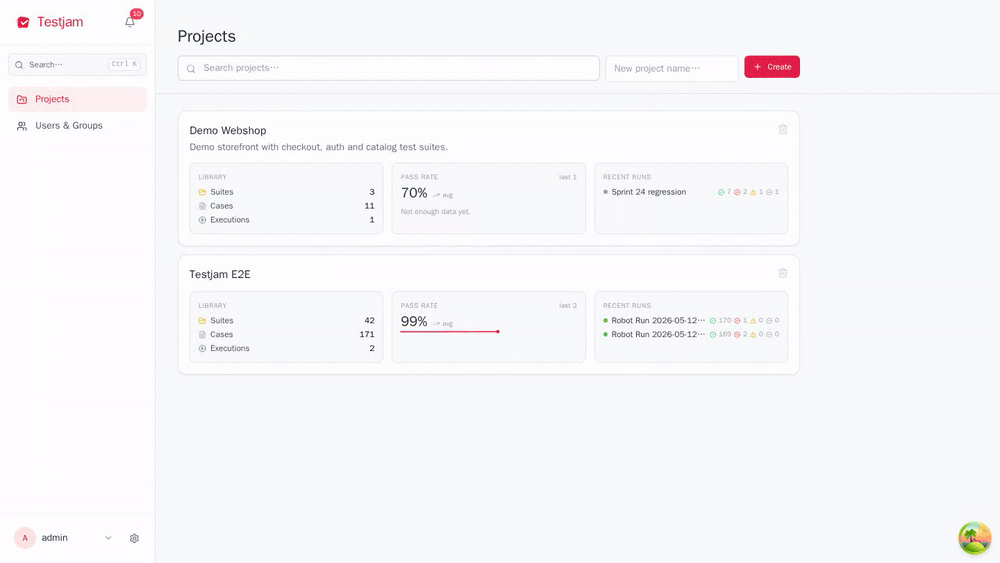

<div align="center">


# Testjam

**Self-hosted test management for teams that ship.**
Plan suites, drive manual runs with keyboard shortcuts, stream CI results live, and export self-contained HTML reports.

[](https://github.com/Jamofer/testjam/actions/workflows/backend.yml)
[](https://github.com/Jamofer/testjam/actions/workflows/frontend.yml)
[](https://github.com/Jamofer/testjam/actions/workflows/e2e.yml)

<p align="center">
  
</p>

</div>

---

## Highlights

|                |                                                                             |
|----------------|-----------------------------------------------------------------------------|
| 📚 **Library** | Projects → nested suites → cases with steps, preconditions, tags, attachments |
| 🎯 **Plans**   | Curate cases from many suites into versioned plans                           |
| ▶️ **Run**      | Manual runs with `j/k` nav + `p/f/b/n` to set status — under a second per case |
| 📡 **Live**    | WebSocket stream of step status + logs from CI via `testjam-listener`        |
| 📥 **Import**  | JUnit and Robot Framework XML, matched by `external_id` or name              |
| 📄 **Reports** | Self-contained HTML, attachments inlined as data URLs                         |
| 🔐 **Access**  | JWT + per-project members with roles + scoped API tokens (`X-API-Key`)       |


<details>
<summary><strong>Stack</strong></summary>

| Layer    | Tech                                                    |
|----------|---------------------------------------------------------|
| Backend  | FastAPI · SQLAlchemy (sync) · Alembic · PostgreSQL 18   |
| Frontend | React 18 · Vite · TanStack Query · Tailwind · Radix UI  |
| Auth     | JWT Bearer + scoped API tokens (`X-API-Key`)            |
| Tests    | pytest · Vitest · Robot Framework (E2E)                 |
| Runtime  | Docker Compose                                          |

</details>

---

## Deploy

```bash
cp .env.example .env
# edit .env: set POSTGRES_PASSWORD and SECRET_KEY=$(openssl rand -hex 32)

docker compose up -d
docker compose exec api python scripts/create_admin.py \
  --username admin --email admin@example.com --password secret
```

Three containers: `db` (Postgres 18), `api` (FastAPI + uvicorn workers), `web` (nginx serving the built frontend + proxying `/api/` to the API).

Only one host port is exposed: `APP_PORT` (default `8080`). Point your external reverse proxy / TLS terminator (nginx, Caddy, Cloudflare, …) at it.

### Required env vars

| Variable             | Purpose                                                |
|----------------------|--------------------------------------------------------|
| `POSTGRES_PASSWORD`  | Password for the bundled Postgres instance.            |
| `SECRET_KEY`         | JWT signing secret. Generate with `openssl rand -hex 32`. |
| `APP_PORT`           | Optional. Host port mapped to the web container (default `8080`). |

### Upgrade

```bash
git pull
docker compose pull        # for any base images that moved
docker compose up -d --build
```

Alembic migrations run automatically on container start.

### Backup & restore

A full backup contains the database dump and the uploads volume.

```bash
# Periodic backup. Honors BACKUP_DIR (default ./backups) and RETENTION_DAYS (default 14).
make backup
```

`scripts/backup.sh` writes a timestamped `testjam-<UTC>.tar.gz` and prunes archives older than `RETENTION_DAYS`. Schedule from cron / systemd timers as needed.

You can also generate or restore a backup from the running app (admin only):

- **Download backup**: Settings → "Download backup" produces a ZIP with `manifest.json`, `dump.sql`, and the `uploads/` tree.
- **Restore from backup**: Settings → "Restore from backup". The form requires uploading the ZIP and typing `REPLACE ALL DATA` to confirm. Restore is destructive — it drops existing tables, replays the dump, and replaces the uploads tree. The backup's `manifest.json` `dialect` must match the running server.

Per-project export ships from the project page (**Export** button) and downloads a `project-<slug>-<UTC>.zip` containing `project.json` plus binary case/result/execution attachments — useful for moving a single project between instances or archiving long-term.

Schema migrations on restore: run `alembic upgrade head` after restoring an older backup. If the dump was produced against a newer schema, downgrade with `alembic downgrade <rev>` first.

---

## Development

Dev uses a separate compose file (`docker-compose-dev.yml`) with bind-mounted source, hot reload, Mailpit on `:8025`, and an `e2e` profile.

```bash
# one-time per shell
export COMPOSE_FILE=docker-compose-dev.yml

docker compose up
docker compose exec api python scripts/create_admin.py \
  --username admin --email admin@example.com --password secret
```

UI on http://localhost:5173 · API on http://localhost:8000/api/docs

### Reset the database

```bash
docker compose down -v && docker compose up
```

### Tests

```bash
make test                # backend + frontend + e2e
make test-api            # pytest (backend)
make test-front          # vitest (frontend)
make test-client         # pytest (testjam-client SDK)
make test-listener       # pytest (Robot Framework listener)
make test-orchestrator   # pytest (e2e orchestrator)
make test-e2e            # orchestrator: 1 Robot execution per leaf suite (parallel)
```

`WORKERS=N` controls both the api uvicorn pool and the orchestrator process pool (default 4). Frontend `node_modules` lives in an anonymous Docker volume — always run `npm`/`vitest` inside the container (the Makefile does this for you), never on the host. The `e2e` service is gated by the `e2e` profile so it never runs on `docker compose up`.

### Single file or test

```bash
make test-api          ARGS=tests/test_executions.py::test_create_manual_execution
make test-front        ARGS=__tests__/PlanDetailPage
make test-client       ARGS=tests/test_projects.py
make test-orchestrator ARGS=orchestrator/tests/test_main.py
make test-e2e          ARGS="-s 'Api Server.01 Auth'"         # single nested suite
make test-e2e          ARGS="-s 'Api Server.*'"               # nested glob
make test-e2e          ARGS="-t 'Successful*'"                # test-name glob
```

---

## Robot Framework listener (external CI)

`listener/` is a standalone `testjam-listener` package. It creates a fresh execution per run, discovers and syncs suites/cases/steps from the Robot tree, and streams pass/fail + per-step duration + per-line logs live.

```bash
pip install ./listener
TESTJAM_API_URL=http://your-host:8080/api/v1 \
TESTJAM_USER=admin TESTJAM_PASS=secret \
TESTJAM_PROJECT="My Project" \
robot --listener testjam_listener.TestjamListener tests/
```

Auth: `TESTJAM_USER` + `TESTJAM_PASS` (admin login) or `TESTJAM_API_KEY`. See `listener/README.md` for details.

## API tokens

**Project → Members → API Tokens** issues a project-scoped token. Send `X-API-Key: <token>` on every request. Cross-project access returns 403.

## Model overview

```
Project
 ├── TestSuite (self-ref: parent_suite_id)
 │    └── TestCase
 │         └── TestStep
 ├── TestPlan ↔ TestCase  (M2M)
 └── TestExecution
      └── TestResult
           └── TestStepResult
```

`TestExecution.type`: `manual` | `automatic`.
Execution status: `pending · in_progress · completed · aborted`.
Result / step status: `not_run · passed · failed · blocked`.
